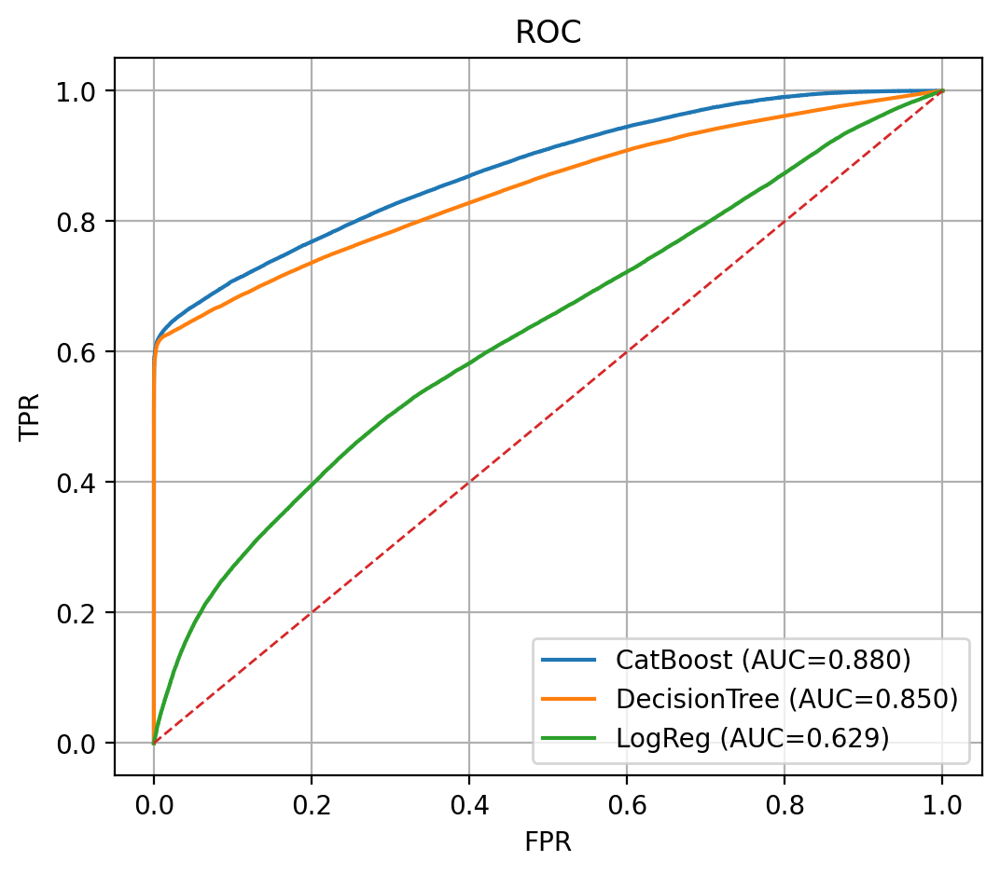
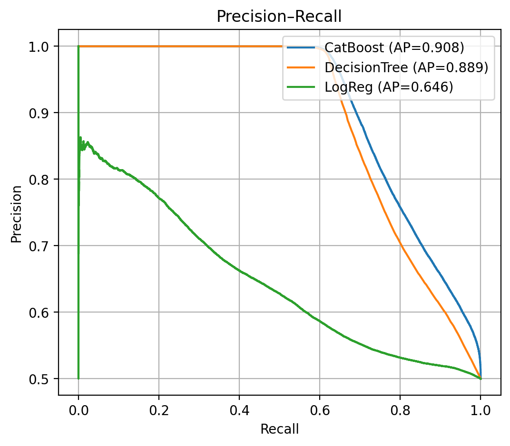

# Рекомендательная система постов для социальной сети
Сервис рекомендаций постов: для заданного пользователя возвращает **Top-N** релевантных публикаций в ленту, учитывая его историю (просмотры/лайки) и признаки пользователя и поста.
## Структура репозитория
```
RecSys-Social-Network/
├─ app.py                 # FastAPI-сервис
├─ database.py            # подключение к БД (SQLAlchemy)
├─ schema.py              # Pydantic-схемы ответов
├─ solution.py            # вспомогательная загрузка модели
├─ table_user.py          # ORM-модель таблицы пользователей
├─ table_post.py          # ORM-модель таблицы постов
├─ table_feed.py          # ORM-модель таблицы действий
├─ requirements.txt
├─ notebooks/
│  ├─ final_project_model.ipynb   # обучение CatBoost + бейзлайны
│  └─ img/
│     ├─ pr_curve.png
│     └─ roc_curve.png
└─ models/
   └─ README.md                   # как получить файл модели
```
## Запуск
1. Установить зависимости
    ```
   pip install -r requirements.txt
3. Запустить сервис
      ```
      uvicorn app:app --reload --port 8899
## Этапы работ

1. **Загрузка данных**
   - Чтение таблиц пользователей, постов и взаимодействий (просмотры/лайки) из базы данных.
   - Контроль размеров и типов данных.

2. **Предварительная обработка**
   - Приведение категориальных признаков к единому виду, работа с пропусками.

3. **Feature Engineering**
   - **One-Hot Encoding (OHE)** для категориальных признаков.
   - **Биннинг** числовых признаков.
   - **Извлечение временных признаков**: Разложение на час/день недели.
   - **Кластеризация текстов**: TF-IDF векторы → PCA для уменьшения количества признаков → K-Means.  
       Используем id кластера и расстояния до центров как признаки.
   - **Отбор признаков** по важности (feature importance CatBoost) и удаление слабых признаков.
   - **Нормализация** признаков перед обучением **Логистической Регрессии**.

4. **Моделирование**
   - Бейзлайны: `DecisionTree`, `LogisticRegression`.
   - Основная модель: `CatBoostClassifier`.
   - Разделение на train/test с фиксированным `seed` для воспроизводимости.

5. **Оценка качества**
   - Метрики валидации: **ROC-AUC / PR-AUC**.
   - Визуализация: ROC и PR кривая Логистической Регрессии, Дерева и Catboost модели.

6. **Инференс-сервис (FastAPI)**
   - Эндпоинт: `/post/recommendations/?id=<user_id>&limit=<k>`.
   - Подготовка признаков для пользователя/постов, расчёт скорингов CatBoost, выдача Top-N.
   
**Требования**

- python (3.11)
- fastapi
- uvicorn
- pandas
- numpy
- scikit-learn
- catboost
- SQLAlchemy
- pydantic

## Результаты

Ниже — сравнительные графики для трёх моделей: CatBoost, DecisionTree и LogisticRegression.
Численные значения метрик вынесены в легенды:

**Графики ROC и PR**

 

**Итог:** CatBoost выигрывает по ROC-AUC и PR-AUC на отложенной выборке; DecisionTree близок, но уступает; LogisticRegression — сильно отстаёт от других моделей.
